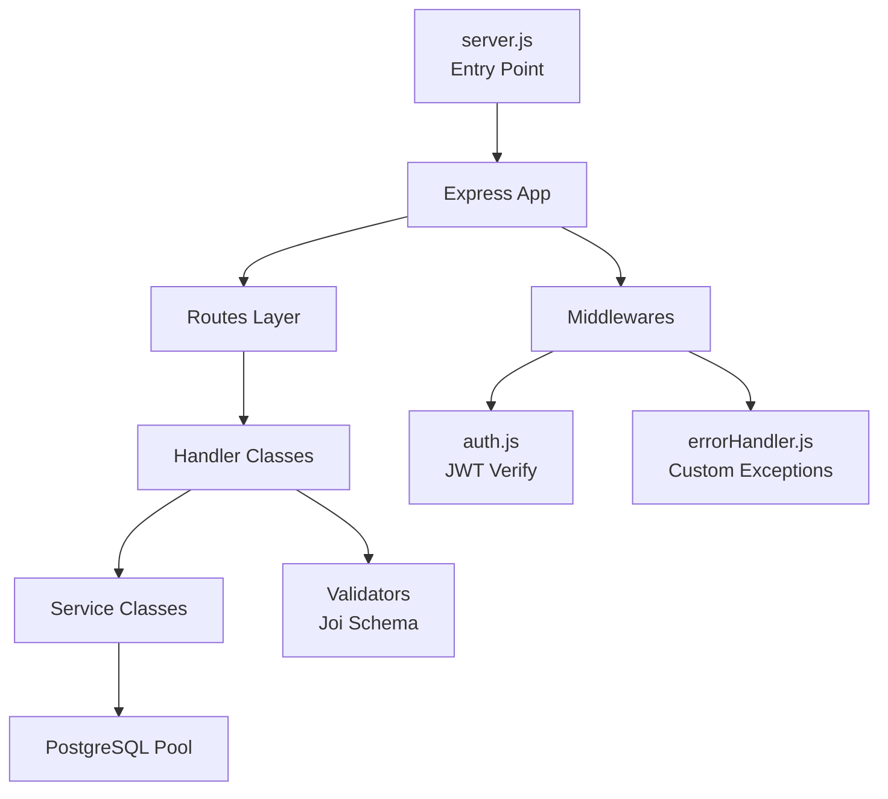
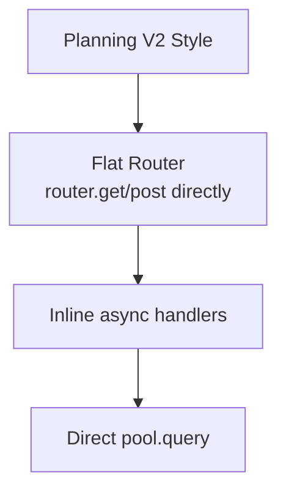
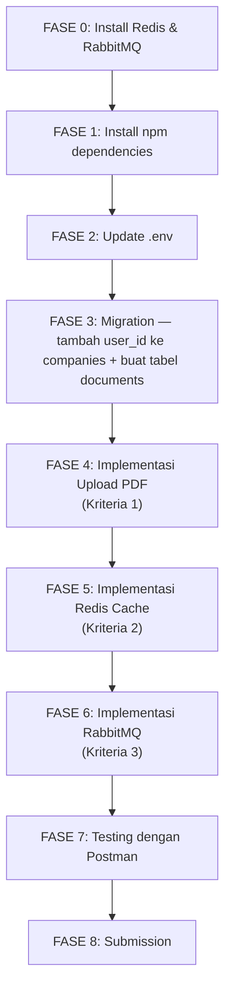

# 🔬 Analisa Mendalam: Planning V2 vs Kode V1 & Kesiapan Sistem

> Dianalisa oleh **Prof. Dr. Meki** — Senior Software Engineer
> Tanggal: 14 Juni 2026

---

## 📊 BAGIAN 1: Status Kesiapan Sistem

### 1.1 Tabel Status Tools

| Tool | Status | Versi/Detail | Yang Dibutuhkan |
|---|---|---|---|
| Node.js | ✅ Terpasang | **v24.11.1** | Planning: v22 LTS (v24 kompatibel ✅) |
| npm | ✅ Terpasang | **v11.6.2** | Cukup ✅ |
| PostgreSQL | ✅ Berjalan | **v16.14**, accepting connections | Sudah berjalan ✅ |
| Database `db_openjob` | ✅ Ada | 7 tabel + pgmigrations | Sudah lengkap ✅ |
| Redis | ❌ **BELUM TERPASANG** | `redis-cli: command not found` | **WAJIB INSTALL** |
| RabbitMQ Server | ❌ **BELUM TERPASANG** | Hanya ada library C, bukan server | **WAJIB INSTALL** |
| Folder `uploads/documents/` | ❌ Belum dibuat | — | Perlu dibuat |
| Newman (Postman CLI) | ✅ Terpasang | Global npm | Berguna untuk testing ✅ |

### 1.2 Dependencies yang Perlu di-Install

| Package | Status di V1 | Kegunaan V2 |
|---|---|---|
| `multer` | ❌ Belum ada | Upload file PDF |
| `ioredis` | ❌ Belum ada | Koneksi ke Redis |
| `amqplib` | ❌ Belum ada | Koneksi ke RabbitMQ |
| `nodemailer` | ❌ Belum ada | Kirim email dari consumer |

### 1.3 Environment Variables (.env)

**V1 saat ini:**
```env
HOST=localhost
PORT=3000
PGUSER=baji
PGPASSWORD=baji12!@
PGDATABASE=db_openjob
PGHOST=localhost
PGPORT=5432
DATABASE_URL=postgres://baji:baji12!@@localhost:5432/db_openjob
ACCESS_TOKEN_KEY=rahasia_level_3_jam_ini_sangat_kuat
REFRESH_TOKEN_KEY=rahasia_level_abadi_lebih_panjang_lagi
```

**Yang perlu DITAMBAHKAN untuk V2:**
```env
# === REDIS ===
REDIS_HOST=127.0.0.1
REDIS_PORT=6379

# === RABBITMQ ===
RABBITMQ_HOST=localhost
RABBITMQ_PORT=5672
RABBITMQ_USER=guest
RABBITMQ_PASSWORD=guest

# === EMAIL / NODEMAILER ===
MAIL_HOST=smtp.gmail.com
MAIL_PORT=587
MAIL_USER=emailkamu@gmail.com
MAIL_PASSWORD=app_password_gmail
```

> [!WARNING]
> Port sudah benar di `3000`. Variabel `.env` V1 menggunakan format `PG*` (auto-detected oleh `pg` Pool), ini sudah oke.

---

## 📊 BAGIAN 2: Analisa Arsitektur V1 vs Planning V2

### 2.1 Arsitektur V1 (Yang Sudah Ada)



**Pattern V1: Class-based Service Architecture**
- `Handler` → Menerima request, validasi, panggil service
- `Service` → Business logic + DB query
- `Validator` → Joi schema validation
- `Routes` → Factory function yang return Express Router

### 2.2 Pattern Planning V2 (Yang di-Planning)



> [!CAUTION]
> ## ⚡ MISMATCH ARSITEKTUR KRITIS
> 
> Planning V2 ditulis dengan **flat Express router style** (inline handlers), tapi V1 menggunakan **class-based Handler + Service + Validator pattern**. Kode dari planning **TIDAK BISA langsung di-copy-paste** — harus diadaptasi ke arsitektur V1!

### 2.3 Mapping Arsitektur: Planning → V1

| Komponen Planning V2 | Harus Dikonversi Ke (V1 Pattern) |
|---|---|
| `document.routes.js` (inline handlers) | `src/api/documents/handler.js` + `routes.js` + `index.js` |
| `upload.middleware.js` | `src/middlewares/upload.js` ✅ bisa langsung |
| `cache.middleware.js` | `src/middlewares/cache.js` ✅ bisa langsung |
| `redis.js` config | `src/config/redis.js` ← folder `config/` BELUM ADA di V1 |
| `rabbitmq.js` publisher | `src/config/rabbitmq.js` ← perlu buat folder |
| `application.consumer.js` | `src/consumer/application.consumer.js` ← perlu buat folder |
| Direct `pool.query()` | `DocumentsService` class di `src/services/postgres/` |

---

## 📊 BAGIAN 3: Analisa Database Schema — GAP KRITIS

### 3.1 Schema Saat Ini vs Kebutuhan V2

| Tabel | Kolom Saat Ini | Yang Dibutuhkan V2 | Status |
|---|---|---|---|
| `users` | `id, fullname, email, password` | Sama | ✅ Oke |
| `companies` | `id, name, description` | **Butuh `user_id`** untuk RabbitMQ | ⚠️ **KRITIS** |
| `jobs` | `id, job_type, ..., company_id, category_id` | Sama | ✅ Oke |
| `applications` | `id, user_id, job_id, status` | Sama | ✅ Oke |
| `bookmarks` | `id, user_id, job_id` | Sama | ✅ Oke |
| `documents` | **BELUM ADA** | `id, user_id, filename, original_name, size, created_at` | 🆕 Perlu buat |

> [!CAUTION]
> ## 🚨 GAP KRITIS: Tabel `companies` TIDAK PUNYA Kolom `user_id`
>
> Planning V2 Fase 6 (RabbitMQ Consumer) membutuhkan query JOIN:
> ```sql
> JOIN companies c ON c.id = j.company_id
> JOIN users owner ON owner.id = c.user_id  -- ← KOLOM INI TIDAK ADA!
> ```
> 
> Tabel `companies` di V1 hanya punya `id, name, description`. **Tidak ada `user_id` untuk menentukan siapa pemilik perusahaan!**
> 
> **Solusi:** Perlu menambah kolom `user_id` ke tabel `companies` via migration baru, DAN memodifikasi `CompaniesService` + `CompaniesHandler` untuk menyimpan `user_id` saat POST.

### 3.2 Kolom Users: `fullname` vs `name`

| Konteks | Nama Kolom di DB | Nama di Kode |
|---|---|---|
| Migration V1 | `fullname` | — |
| `UsersService.getUserById()` | `SELECT id, fullname as name` | Di-alias ke `name` |
| `UsersHandler.getUserByIdHandler()` | — | Response: `name` dan `fullname` |
| Planning V2 `addUser()` | Pakai `name` di INSERT | ⚠️ Harus pakai `fullname` |

> [!NOTE]
> V1 meng-INSERT ke kolom `fullname` via `INSERT INTO users VALUES($1, $2, $3, $4)` — parameter urutan: `id, name, email, password`. Kolom DB sebenarnya `fullname`, tapi insert by position. Ini **sudah benar** karena urutan match.

---

## 📊 BAGIAN 4: Analisa Per-Kriteria — Detail Adaptasi

### Kriteria 1: Upload PDF (Multer)

**Status: Perlu dibuat dari nol, tapi straightforward**

File yang perlu dibuat:
1. `src/middlewares/upload.js` — Multer config (bisa hampir sama dengan planning)
2. `src/services/postgres/DocumentsService.js` — Service class (adapt dari planning)
3. `src/api/documents/handler.js` — Handler class
4. `src/api/documents/routes.js` — Routes factory
5. `src/api/documents/index.js` — API factory
6. Migration baru untuk tabel `documents`

**Adaptasi yang diperlukan:**
- Planning pakai `nanoid()` langsung, V1 pakai prefix `document-${nanoid(16)}`
- Planning pakai direct pool import, V1 pakai `this._pool` di class
- Planning pakai `authMiddleware` dari `../middlewares/auth.middleware.js`, V1 dari `../../middlewares/auth.js`

### Kriteria 2: Caching Redis

**Status: Perlu modifikasi BANYAK file existing**

File yang perlu dibuat baru:
1. `src/config/redis.js` — Koneksi Redis (folder `config/` belum ada)
2. `src/middlewares/cache.js` — Cache middleware + helper

File yang perlu DIMODIFIKASI (existing V1):
1. `src/api/companies/routes.js` — Tambah cache middleware di GET /:id
2. `src/api/companies/handler.js` — Tambah deleteCache di PUT dan DELETE
3. `src/api/users/routes.js` — Tambah cache middleware di GET /:id
4. `src/api/users/handler.js` — Tambah deleteCache di PUT (⚠️ PUT users belum ada!)
5. `src/api/applications/routes.js` — Tambah cache di GET /:id, GET /user/:userId, GET /job/:jobId
6. `src/api/applications/handler.js` — Tambah deleteCache di POST, PUT, DELETE
7. `src/api/bookmarks/routes.js` — Tambah cache di GET /
8. `src/api/bookmarks/handler.js` — Tambah deleteCache di POST, DELETE

> [!WARNING]
> **Endpoint yang diuji cache tapi BELUM ADA di V1:**
> - `PUT /users/:id` — **Route ini TIDAK ADA** di V1! Postman cache test mungkin butuh invalidation setelah update user.
> - Perlu dicek apakah Postman V2 test collection benar-benar menguji `PUT /users/:id` atau hanya GET cache-nya saja.

### Kriteria 3: RabbitMQ + Nodemailer

**Status: Perlu dibuat dari nol + modifikasi kritis**

File yang perlu dibuat baru:
1. `src/config/rabbitmq.js` — Publisher
2. `src/consumer/application.consumer.js` — Consumer + email

File yang perlu DIMODIFIKASI:
1. `src/server.js` — Panggil `connectRabbitMQ()` saat start
2. `src/api/applications/handler.js` — Panggil `publishApplicationCreated()` setelah POST berhasil
3. `package.json` — Tambah script `"consumer"`

**Modifikasi KRITIS:**
1. **Tabel `companies`** perlu kolom `user_id` (migration baru)
2. **`CompaniesService.addCompany()`** perlu terima dan simpan `user_id`
3. **`CompaniesHandler.postCompanyHandler()`** perlu kirim `req.user.id` ke service

---

## 📊 BAGIAN 5: Route Parameter Mismatch

| Endpoint V2 (Planning/Postman) | Route V1 Saat Ini | Cocok? |
|---|---|---|
| `GET /applications/user/:userId` | `GET /applications/user/:user_id` | ⚠️ **Param name beda!** |
| `GET /applications/job/:jobId` | `GET /applications/job/:job_id` | ⚠️ **Param name beda!** |

> [!IMPORTANT]
> Planning V2 cache key pakai `req.params.userId` dan `req.params.jobId`, tapi V1 routes menggunakan `:user_id` dan `:job_id`. Ini akan menyebabkan cache key jadi `undefined`!
> 
> **Solusi:** Sesuaikan cache key function dengan nama parameter V1, ATAU ubah route params V1 agar sesuai Postman V2.

---

## 📊 BAGIAN 6: Ringkasan GAP & Prioritas

### 🔴 KRITIS (Harus diselesaikan, bisa gagal test)

| # | Gap | Dampak |
|---|---|---|
| 1 | Redis **belum terpasang** | Kriteria 2 tidak bisa jalan sama sekali |
| 2 | RabbitMQ Server **belum terpasang** | Kriteria 3 tidak bisa jalan sama sekali |
| 3 | Tabel `companies` tidak punya `user_id` | Consumer email tidak bisa cari owner job |
| 4 | Arsitektur mismatch (planning flat vs V1 class-based) | Kode planning tidak bisa langsung dipakai |
| 5 | Route params `:user_id`/`:job_id` vs `:userId`/`:jobId` | Cache key akan `undefined` |

### 🟡 PENTING (Perlu ditambahkan)

| # | Gap | Dampak |
|---|---|---|
| 6 | Tabel `documents` belum ada | Kriteria 1 butuh tabel ini |
| 7 | Dependencies (`multer`, `ioredis`, `amqplib`, `nodemailer`) | Semua kriteria V2 butuh ini |
| 8 | Folder `uploads/documents/` belum ada | Upload PDF gagal |
| 9 | `.env` belum ada variabel Redis, RabbitMQ, Mail | Koneksi gagal |
| 10 | `src/config/` folder belum ada | Perlu dibuat |

### 🟢 MINOR (Bisa diatasi saat implementasi)

| # | Gap | Dampak |
|---|---|---|
| 11 | `PUT /users/:id` belum ada di V1 | Cache invalidation user mungkin perlu |
| 12 | `package.json` belum punya script `consumer` | Consumer tidak bisa dijalankan |
| 13 | Gmail App Password perlu disiapkan | Email testing |

---

## 📊 BAGIAN 7: Rekomendasi Urutan Kerja



### Estimasi Pekerjaan

| Fase | File Baru | File Dimodifikasi | Estimasi Kompleksitas |
|---|---|---|---|
| Persiapan (0-3) | 0 | 2 (.env, package.json) | 🟢 Rendah |
| Kriteria 1 — Upload PDF | 5-6 file | 1 (server.js) | 🟡 Sedang |
| Kriteria 2 — Redis Cache | 2 file | 6-8 file (handlers + routes) | 🔴 Tinggi |
| Kriteria 3 — RabbitMQ | 2 file | 3 file (server.js, handler, companies) | 🟡 Sedang |

---

## ✅ Kesimpulan

**Project V1 adalah base yang solid**, tapi ada beberapa gap kritis yang harus diatasi sebelum mengimplementasikan planning V2. Yang paling kritis:

1. **Install Redis dan RabbitMQ** di sistem
2. **Tambah kolom `user_id` ke tabel `companies`** — tanpa ini, fitur email notifikasi ke pemilik job tidak akan berfungsi
3. **Adaptasi kode planning ke arsitektur V1** — tidak bisa copy-paste langsung

Tuan Baji siap untuk mulai implementasi? Saya rekomendasikan mulai dari **install Redis & RabbitMQ** terlebih dahulu.
